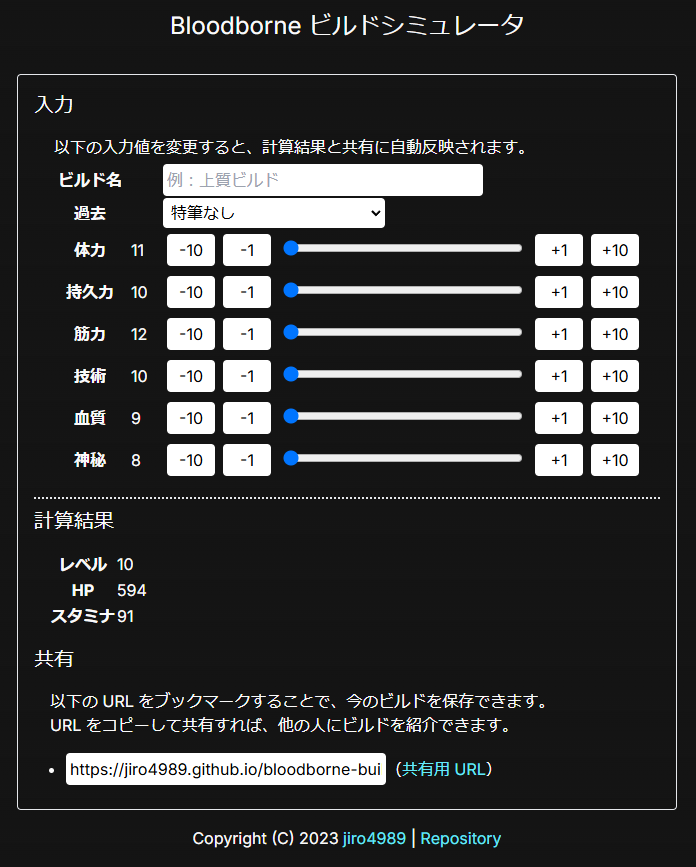

= bloodborne-build-simulator
:toc: left
:sectnums:

Bloodborneのビルドシミュレータです。
URL でビルドを共有できるものがほしかったので自作しました。

== サイト

以下の URL で公開しています。

* https://jiro4989.github.io/bloodborne-build-simulator/

== 使い方

過去を選択して、スライダーやボタンでパラメータを調整します。

設定が終わったら共有用の URL をブックマークするなり、共有するなりしてください。

== 開発者用

=== 技術スタック

* Next.js
* TypeScript

=== ローカル環境で起動する

以下のコマンドを実行すると、 http://localhost:1323 でアクセスできるようになる。

[source,bash]
----
npm run dev
----

=== 静的ファイル出力

GitHub Pagesでホスティングするための、静的ファイルを出力するには以下のコマンドを実行する。
結果は `out` ディレクトリに出力される。

[source,bash]
----
npm run build
----
